# Architecture

This document describes how `duv`'s code is organized and why. It's aimed at
contributors (human or AI agent) who need to know _where_ to add new
functionality and _how_ the pieces communicate.

> **Status:** early development. Disk enumeration, directory scanning into
> an in-memory tree, and drill-down navigation of that tree exist. No
> delete/manage actions or memory budget yet. This document describes the
> current skeleton and the conventions to extend it, not a finished
> product.

## Overview: Model – Update – View

`duv` follows an Elm-style architecture: a single state struct (**Model**),
a pure function that mutates it in response to input (**Update**), and a
pure function that renders it (**View**). Input arrives asynchronously via a
dedicated event thread, decoupled from both update and render.

```mermaid
flowchart LR
    subgraph bg[Background thread]
        EV[event.rs\nEventHandler]
    end
    EV -- mpsc channel --> MAIN[main.rs\nmain loop]
    MAIN -- KeyEvent --> UPD[update.rs\nupdate&#40;&#41;]
    UPD -- mutates --> APP[app.rs\nApp state]
    DISKS[disks.rs\nlist&#40;&#41;] -- populates --> APP
    UPD -- start_scan&#40;&#41; / enter_selected&#40;&#41; --> SCAN
    subgraph bg2[Scan thread pool]
        WALK[scanner.rs\nwalk → Subtree]
    end
    WALK -- mpsc channel --> SCAN[scanner.rs\nScanner]
    SCAN -- attach&#40;&#41; --> TREE[model.rs\nTree]
    APP -- owns --> SCAN
    APP -- scanner_history --> APP
    MAIN -- Event::Tick --> APP
    MAIN -- draw --> TUI[tui.rs\nTui]
    TUI -- calls --> UI[ui.rs\nrender&#40;&#41;]
    UI -- reads --> APP
```



## Modules

### `cli.rs` — argument parsing

`Cli` (derived with `clap`) models `duv [path]`; `path` is optional
(`duv .` scans the current directory). `Cli::start_path()` canonicalizes
the path and rejects missing or non-directory paths; `main.rs` calls it
before the terminal enters raw mode, so bad input produces an ordinary
shell error. With `Some(path)`, `main` builds the app with
`App::with_start_path`, which begins scanning that directory immediately;
with `None` it uses `App::new()` and opens on the disk list.

### `app.rs` — Model

Holds all application state: `should_quit`, whether to show a quit confirmation
(`quit_confirmation: Option<QuitOption>`), the list of mounted disks
(`disks: Vec<disks::DiskInfo>`), the currently highlighted disk row
(`selected: usize`), and the drill-down navigation state:

- `scanner: Option<scanner::Scanner>` — the currently displayed scan.
  `None` means the disk list is showing. A `Scanner` holds the whole tree
  under its root, so drilling into subdirectories and back out happens
  inside it (`Scanner::enter_selected`/`Scanner::go_up`) with no I/O.
- `scanner_history: Vec<scanner::Scanner>` — earlier scans to restore when
  backing out past the current scanner's root. It only grows when the
  tree can't answer: opening a directory whose contents weren't collected
  (another filesystem, or unreadable) spawns a fresh `Scanner` there, and
  `s` in a subdirectory rescans just that directory while the previous
  scan (moved up to the parent) is kept here. `go_back()` first moves up
  within the current scanner, then pops this stack, then falls back to
  the disk list.
- `scanner_error: Option<String>` — set if the most recent scan attempt
  failed to even list its root directory (e.g. a permissions error).

Deliberately has **no dependency on ratatui's rendering types** (`Buffer`,
`Rect`, `Widget`) or crossterm's event types — it doesn't know how it's
drawn or how input arrives. It also avoids depending on `sysinfo`'s types
directly, going through `disks::DiskInfo` instead (see below).

### `disks.rs` — disk/volume enumeration

`disks::list() -> Vec<DiskInfo>` wraps `sysinfo::Disks` to enumerate every
mounted disk/volume visible to the OS (handling the case where a machine
has more than one disk). `DiskInfo` and `DiskKind` are plain, crate-local
types — not re-exports of `sysinfo`'s — so the `sysinfo` dependency stays
isolated to this one module and `App` never has to know about it. This is
the first step toward letting the user pick which disk/volume to scan;
`App::new()` currently populates `disks` once at startup via `disks::list()`.

Also home to `format_bytes()`, a small binary-unit (`KiB`/`MiB`/...)
human-readable size formatter used by `ui.rs`.

### `model.rs` — in-memory tree

`Tree` stores every scanned file and directory in one flat `Vec<Node>`,
addressed by `NodeId` (a `u32` index); nodes point to their parent and
children by id rather than through nested allocations. Each `Node` keeps
only its own name (`Box<str>`), its size, its parent, and its kind — full
paths are rebuilt on demand by `Tree::path`, so no `PathBuf` is stored per
node. A test guards `Node` at 64 bytes or less.

A directory's children are either `Children::Loaded(Vec<NodeId>)` or
`Children::Unloaded`. An unloaded directory still has an accurate `size`;
its entries just aren't in memory. Today that's used for directories on
another filesystem and unreadable ones; it's also the hook for a future
memory budget that evicts rarely visited branches without changing any
totals.

The invariant is that a loaded directory's `size` is the sum of its
children's. `Tree::add_child` and `Tree::attach` keep it by adding each new
node's size to all of its ancestors. `Subtree` is a temporary nested form
of one branch, built by the scanner's parallel walk (whose threads can't
share one `Tree`) and flattened into the tree in a single pass by
`Tree::attach`. `Tree::approx_bytes()` keeps a running estimate of the
tree's memory use, and `Tree::sort_children_by_size` orders every loaded
directory largest first.

### `scanner.rs` — scanning and in-scan navigation

`Scanner::spawn(root: PathBuf) -> io::Result<Scanner>` walks everything
under `root` — a disk's mount point, or any directory given on the command
line or opened from the UI — and records it in a `model::Tree`
(`Scanner::tree`).

Listing `root` itself happens synchronously (cheap, single `read_dir`), so
the returned `Scanner` immediately knows `total`. Each first-level child is
then walked on a background thread, parallelized across subdirectories with
`rayon` (`ParallelBridge`/`into_par_iter`), into a `Subtree`, which is sent
over an `mpsc::channel<Subtree>`.

`Scanner::poll()` is non-blocking — it grafts whatever's arrived into the
tree with `Tree::attach`, and sorts the tree by size once, on the tick the
scan finishes — and is called from `App::tick()` on every `Event::Tick`
(see `event.rs`).

Once finished, the `Scanner` is also the navigator for its tree. It tracks
the directory being shown, its `selected` row and ratatui `table_state`,
and a stack of parent views. `enter_selected()` returns
`Enter::Entered` (moved into a loaded directory, no I/O),
`Enter::NeedsScan(path)` (the directory is unloaded, so `App` spawns a
new `Scanner` there), or `Enter::Ignored` (a file, or the scan isn't
finished). `go_up()` restores the parent view, including its selection and
scroll position. `current_path()`, `entries()` and `entry_count()` give the
UI what to show.

Symlinks are never followed (avoids cycles and double-counting), and
recursion never crosses filesystem boundaries (like `du -x`/
`--one-file-system`): a subdirectory that's the mount point of a different
filesystem than `root` becomes an unloaded, zero-sized node instead of
being summed in. Without this, walking e.g. `/` on macOS would also sum in
`/System/Volumes/Data`, anything mounted under `/Volumes`, network shares,
etc., wildly inflating totals past the disk's actual capacity. Errors on a
given entry are swallowed rather than failing the whole scan; a directory
that can't be listed becomes an unloaded, zero-sized node, so opening it
tries a fresh scan that reports the error. Only a failure to list a
scan's own `root` surfaces as `App::scanner_error`. Hard-linked files are
currently counted once per link, so totals can exceed `du`'s.

This module has real filesystem-backed tests (per `AGENTS.md`'s stated
preference for scanning logic), not mocked ones.

### `event.rs` — input source

`EventHandler` spawns a dedicated OS thread that polls crossterm for input
and forwards everything through an `mpsc` channel as a unified `Event` enum:

- `Event::Tick` — fires on a fixed interval (currently 250ms), independent
  of key activity. Intended for driving background progress (e.g. live scan
  updates) even when the user isn't pressing keys.
- `Event::Key` / `Event::Mouse` / `Event::Resize` — forwarded crossterm
  events.

The main thread calls `events.next()` (blocking) once per loop iteration,
decoupling "wait for the next thing to happen" from "redraw."

### `update.rs` — Update (reducer)

`update(app: &mut App, key_event: KeyEvent)` is where key presses are
translated into state mutations, mapping both vim-style (`j`/`k`/`h`/`l`)
and non-vim (arrow keys, `Enter`, `Backspace`) input to the same actions so
both interaction styles are supported simultaneously. Currently handles:

- `q` / `Esc` (on disk list) — trigger a quit confirmation popup.
- `Ctrl+C` — quit unconditionally.
- `Esc` — goes back one level (`App::go_back`) if a scan/error view is
  open; triggers quit confirmation otherwise. This lets `Esc` act as "back" before it acts as
  "quit."
- `h` / `Left` / `Backspace` — same as `Esc`, but only when there's
  somewhere to go back to (no-op on the disk list). Going back moves up
  within the current scan's tree before leaving it.
- `j`/`Down`, `k`/`Up` — move the disk-list selection when no scan is
  open, or the current scan's row selection once it's finished
  (`App::select_next`/`App::select_previous` vs. `Scanner::select_next`/
  `Scanner::select_previous`).
- `l` / `Right` / `Enter` — drill into the selected entry if it's a
  directory (`App::enter_selected`), straight from the tree when its
  contents are loaded.
- `s` — start a scan of the selected disk's mount point, or re-scan the
  directory currently shown if a scan is open (`App::start_scan`).

Future additions (`gg`/`G`, `Home`/`End`, etc.) belong here too.

### `ui.rs` — View

`render(app: &mut App, frame: &mut Frame)` is a rendering function: it
reads `App`/`Scanner` state and produces widgets. It takes `&mut App`
because ratatui's stateful widgets (`TableState`) need a mutable reference
to record their scroll offset between frames — no application-level state
(selection, scan results, etc.) is mutated here, only rendering-owned
scroll bookkeeping. Keeping this a free function (rather than
`impl Widget for &App`) keeps `app.rs` fully decoupled from ratatui's
rendering types. Dispatches on `App` state to one of three views:

- No scan open and no error — `app.disks` as a `Table`, rendered
  statefully with `app.disks_table_state` (name, mount point, kind,
  filesystem, used/available/total space via `disks::format_bytes`),
  highlighting the row at `app.selected` and auto-scrolling to keep it in
  view once the list is taller than the terminal.
- A scan in progress (`app.scanner` is `Some` and not finished) — a `Gauge`
  progress bar (with a border) showing `scanner.measured / scanner.total`
  first-level entries.
- A finished scan — a `Table` of `scanner.entries()` for the directory
  currently shown (name, Dir/File, size), sorted by size descending and
  titled with `scanner.current_path()`, rendered statefully with
  `scanner.table_state` (same highlighting/auto-scroll behavior as the
  disk table).
- `app.scanner_error` set — an error `Paragraph` instead of any of the
  above.
- `app.quit_confirmation` set — a centered modal popup asking the user to
  confirm quitting, with "Yes" and "No" options.

### `tui.rs` — terminal lifecycle

`Tui` bundles the `ratatui::Terminal` and `EventHandler` and owns:

- `enter()` — enables raw mode, enters the alternate screen, enables mouse
  capture, and installs a panic hook that restores the terminal before
  re-raising the panic (so a crash never leaves the user's shell broken).
- `draw(&mut App)` — delegates to `ui::render`.
- `exit()` — reverses `enter()`.

The backend writes to `stderr`, not `stdout`, so that `stdout` stays free for
piping/redirection separate from the TUI's own screen buffer.

### `main.rs` — composition root

Thin entry point: parses `Cli`, constructs `App`, `Terminal`, `EventHandler`, wraps them
in `Tui`, then loops:

```rust
while !app.should_quit {
    tui.draw(&mut app)?;
    match tui.events.next()? {
        Event::Tick => app.tick(),
        Event::Key(key_event) => update(&mut app, key_event),
        Event::Mouse(_) => {}
        Event::Resize(_, _) => {}
    };
}
tui.exit()?;
```

## Dependencies

- **`ratatui`** — TUI rendering; pulls in the `crossterm` backend by
  default. See `AGENTS.md` for the rationale behind this choice.
- **`anyhow`** — ergonomic error propagation (`Result<()>`) across the event
  thread and terminal setup/teardown paths.
- **`sysinfo`** (`default-features = false, features = ["disk"]`) — disk/
  volume enumeration in `disks.rs`. Disabling default features and opting
  into only the `disk` feature keeps this dependency's footprint minimal,
  per `AGENTS.md`'s lightweight-dependency convention.
- **`clap`** (`derive` plus minimal features, no colour/suggestions) —
  argument parsing in `cli.rs`.
- **`rayon`** — work-stealing parallelism for recursively sizing
  directories in `scanner.rs`. This is the core value proposition of a
  "fast" disk usage tool, so parallelizing the I/O-bound directory walk
  across cores is worth the dependency; `AGENTS.md`'s planned architecture
  already flagged `rayon` as the intended choice for this.

## Planned additions

Not yet implemented; will slot into the modules above as they land:

- **Memory budget** — cap `Tree::approx_bytes()` and evict the children of
  the least recently visited directories (marking them `Unloaded`) when
  it's exceeded, never the directory being shown or its ancestors.
- **Delete/manage actions** — acting on a selected entry (delete, reveal in
  Finder/file manager, etc.).

Don't scaffold these preemptively — add them when the corresponding feature
is actually being built.
