# Architecture

This document describes how `duv`'s code is organized and why. It's aimed at
contributors (human or AI agent) who need to know _where_ to add new
functionality and _how_ the pieces communicate.

> **Status:** early development. Disk enumeration, directory scanning into
> a memory-budgeted in-memory tree, and drill-down navigation of that tree
> exist, plus moving entries to the Trash. No other manage actions yet. This document describes the
> current skeleton and the conventions to extend it, not a finished
> product.

## Overview: Model – Update – View

`duv` follows an Elm-style architecture: a single state struct (**Model**),
a pure function that mutates it in response to input (**Update**), and a
pure function that renders it (**View**). Input arrives asynchronously via a
dedicated event thread, decoupled from both update and render.

```mermaid
flowchart LR
    subgraph bg[Background thread]
        EV[event.rs\nEventHandler]
    end
    EV -- mpsc channel --> MAIN[main.rs\nmain loop]
    MAIN -- KeyEvent --> UPD[update.rs\nupdate&#40;&#41;]
    UPD -- mutates --> APP[app.rs\nApp state]
    DISKS[disks.rs\nlist&#40;&#41;] -- populates --> APP
    UPD -- start_scan&#40;&#41; / enter_selected&#40;&#41; --> SCAN
    subgraph bg2[Scan thread pool]
        WALK[scanner.rs\nwalk&#40;&#41;]
    end
    WALK -- one listing per directory --> SCAN[scanner.rs\nScanner]
    SCAN -- add / fold / evict --> TREE[model.rs\nTree]
    APP -- owns --> SCAN
    APP -- scanner_history --> APP
    MAIN -- Event::Tick --> APP
    MAIN -- draw --> TUI[tui.rs\nTui]
    TUI -- calls --> UI[ui.rs\nrender&#40;&#41;]
    UI -- reads --> APP
```



## Modules

### `cli.rs` — argument parsing

`Cli` (derived with `clap`) models `duv [path]`; `path` is optional
(`duv .` scans the current directory). `Cli::start_path()` canonicalizes
the path and rejects missing or non-directory paths; `main.rs` calls it
before the terminal enters raw mode, so bad input produces an ordinary
shell error. With `Some(path)`, `main` builds the app with
`App::with_start_path`, which begins scanning that directory immediately;
with `None` it uses `App::new()` and opens on the disk list.

`--memory-budget <MIB>` (default 256, from `scanner::DEFAULT_MEMORY_BUDGET`)
sets each scan's tree budget; see `scanner.rs`. The hidden `--stats` flag
runs `stats.rs` instead of the TUI.

### `app.rs` — Model

Holds all application state: `should_quit`, whether to show a quit confirmation
(`quit_confirmation: Option<Choice>`), the list of mounted disks
(`disks: Vec<disks::DiskInfo>`), the currently highlighted disk row
(`selected: usize`), and the drill-down navigation state:

- `scanner: Option<scanner::Scanner>` — the currently displayed scan.
  `None` means the disk list is showing. A `Scanner` holds the tree under
  its root, so drilling into subdirectories and back out happens inside
  it (`Scanner::enter_selected`/`Scanner::go_up`) — with no I/O, or by
  loading a directory in place if it was left out to stay within budget.
- `scanner_history: Vec<scanner::Scanner>` — earlier scans to restore when
  backing out past the current scanner's root. It only grows when the
  tree can't answer: opening a directory whose contents weren't collected
  (another filesystem, or unreadable) spawns a fresh `Scanner` there, and
  `s` in a subdirectory rescans just that directory while the previous
  scan (moved up to the parent) is kept here. `go_back()` first moves up
  within the current scanner, then pops this stack, then falls back to
  the disk list.
- `memory_budget: usize` — passed to every `Scanner` it spawns.
- `page_size: usize` — list rows visible on screen, written by `ui.rs` on
  every render, so page jumps match what's on screen.
- `pending_g: bool` — the first half of a `gg` key sequence.
- `delete_confirmation: Option<DeleteRequest>` — the entry (path, name,
  size, kind) the user asked to move to the Trash, and the highlighted
  `Choice` (defaults to `No`). `request_delete()` opens it for the
  highlighted entry of a finished scan; `confirm_delete()` closes it and,
  on `Yes`, calls `trash` and then `Scanner::forget` on the current scanner
  **and every scanner in `scanner_history`**, so totals stay right when
  backing out. A failure sets `notice` instead.
- `notice: Option<String>` — a message shown in a popup until the next
  key press (currently: failed deletes).
- `trash: TrashFn` — the function that moves a path to the Trash;
  `move_to_trash` (the `trash` crate, using `NSFileManager` on macOS so it
  never triggers a Finder automation prompt) by default, swapped for a
  plain delete inside a temp directory in tests.
- `scanner_error: Option<String>` — set if the most recent scan attempt
  failed to even list its root directory (e.g. a permissions error).

Deliberately has **no dependency on ratatui's rendering types** (`Buffer`,
`Rect`, `Widget`) or crossterm's event types — it doesn't know how it's
drawn or how input arrives. It also avoids depending on `sysinfo`'s types
directly, going through `disks::DiskInfo` instead (see below).

### `disks.rs` — disk/volume enumeration

`disks::list() -> Vec<DiskInfo>` wraps `sysinfo::Disks` to enumerate every
mounted disk/volume visible to the OS (handling the case where a machine
has more than one disk). `DiskInfo` and `DiskKind` are plain, crate-local
types — not re-exports of `sysinfo`'s — so the `sysinfo` dependency stays
isolated to this one module and `App` never has to know about it. This is
the first step toward letting the user pick which disk/volume to scan;
`App::new()` currently populates `disks` once at startup via `disks::list()`.

Also home to `format_bytes()`, a small binary-unit (`KiB`/`MiB`/...)
human-readable size formatter used by `ui.rs`.

### `model.rs` — in-memory tree

`Tree` stores scanned files and directories in one flat `Vec<Node>`,
addressed by `NodeId` (a `u32` index); nodes point to their parent and
children by id rather than through nested allocations. Each `Node` keeps
only its own name (`Box<str>`), its size, its parent, and its kind — full
paths are rebuilt on demand by `Tree::path`, so no `PathBuf` is stored per
node. A test guards `Node` at 64 bytes or less.

A directory's `Children` say whether its entries are in memory:

- `Loaded(Vec<NodeId>)` — they are.
- `Unloaded` — they aren't (not listed yet, skipped to stay within the
  memory budget, or evicted), but `size` is still the exact total. The
  scanner can load them in place later.
- `OtherFilesystem` — a mount point of another filesystem; size `0`,
  never loaded into this tree.
- `Unreadable` — couldn't be listed.

The invariant is that a loaded directory's `size` is the sum of its
children's; `add_child`, `add_size`, `subtract_size` and `clear_size` keep
it by applying every change to all ancestors. `remove` deletes a node and
everything under it (after a delete on disk), and `lookup(path)` finds
where a path sits: its node, the `Unloaded` directory containing it, a
directory whose space isn't counted, or outside the tree. `evict_children` drops everything under a
directory (marking it `Unloaded`, sizes unchanged) and turns those nodes
into `NodeKind::Free` slots, which `add_child` reuses before growing the
list — so memory really stops growing at the budget. `get` never returns
free slots. `approx_bytes()` keeps a running estimate of live nodes'
memory, which is what the budget is measured against;
`sort_subtree_by_size` orders a directory and everything under it largest
first, and `shrink_to_fit` releases spare capacity after a scan.

### `scanner.rs` — scanning, memory budget and in-scan navigation

`Scanner::spawn(root, budget) -> io::Result<Scanner>` walks everything
under `root` — a disk's mount point, or any directory given on the command
line or opened from the UI — and records it in a `model::Tree`
(`Scanner::tree`), keeping `tree.approx_bytes()` within `budget`.

Listing `root` itself happens synchronously (cheap, single `read_dir`), so
a failure to read it is returned immediately and its entries are in the
tree right away. Its subdirectories are then walked on a background thread,
parallelized with `rayon` (`into_par_iter` across subdirectories,
`ParallelBridge` across one directory's entries). The walk sends one
`Msg::Listed` per directory with just its direct entries; subdirectories
are identified by tokens it hands out, which `Scanner::pending` maps to
tree nodes as their parents' listings arrive. Streaming per directory
(rather than building whole branches off-tree first) avoids holding a
second copy of large branches during the scan. `Msg::BranchDone` per
first-level subdirectory drives the progress gauge (`measured`/`total`).

`Scanner::poll()` is non-blocking — it applies whatever has arrived, and
sorts the scanned directory's subtree by size once the walk ends — and is
called from `App::tick()` on every `Event::Tick` (see `event.rs`).

**Memory budget.** When a listing arrives while the tree is over budget,
its entries aren't stored: their sizes are added to the directory, which
stays `Unloaded`, and its subdirectories' listings are folded into it the
same way. The directory being scanned itself is always stored, so the
view you're looking at is complete; totals are exact at any budget.
Opening an `Unloaded` directory loads it in place (`Enter::Loading`): if
the tree is above three quarters of the budget, the entries of loaded
directories hanging off the current path are evicted first, least
recently visited first (`last_visit`; showing a directory also counts as
visiting its ancestors), and never the current path itself. The budget is
measured by `approx_bytes()`, which excludes allocator overhead and
transient memory; peak RSS was about 1.5× the tree estimate with no
folding, plus roughly 50 MB with tight budgets (see `stats.rs`).

Once a scan finishes, the `Scanner` is also the navigator for its tree. It
tracks the directory being shown, its `selected` row and ratatui
`table_state`, and a stack of parent views. `enter_selected()` returns
`Enter::Entered` (a loaded directory, no I/O), `Enter::Loading` (an
unloaded directory, now being scanned into the tree; `finished` is
`false` until done), `Enter::NeedsScan(path)` (another filesystem or
unreadable, so `App` spawns a new `Scanner` there), or `Enter::Ignored` (a
file, or a scan is running). `go_up()` restores the parent view, including
its selection and scroll position. `current_path()`, `entries()`,
`entry_count()` and `selected_entry()` give the UI and `App` what to show.
`forget(path, size)` updates the tree after a delete on disk: it removes
the path's node, or subtracts `size` from the unloaded directory containing
it. It skips scanners that are still running (their pending listings could
point at removed nodes) and never removes the current directory or its
parents.

Symlinks are never followed (avoids cycles and double-counting), and
recursion never crosses filesystem boundaries (like `du -x`/
`--one-file-system`): a subdirectory that's the mount point of a different
filesystem than `root` becomes an `OtherFilesystem` node of size `0`
instead of being summed in. Without this, walking e.g. `/` on macOS would
also sum in `/System/Volumes/Data`, anything mounted under `/Volumes`,
network shares, etc., wildly inflating totals past the disk's actual
capacity. Errors on a given entry are swallowed rather than failing the
whole scan; a directory that can't be listed becomes `Unreadable`, so
opening it tries a fresh scan that reports the error. Only a failure to
list a scan's own `root` surfaces as `App::scanner_error`.

A file with several hard links is counted once, like `du` does. Each scan
job shares a `WalkCtx` across its walk threads, holding a mutex-guarded
set of `(device, inode)` pairs; only files with a link count above one
touch it. The first link seen in the job counts its full size and later
links count `0` (they stay in the tree as entries). Which link is "first"
depends on thread timing, and a folder loaded in place later is counted
on its own, so a link whose other half lives elsewhere in the tree can be
counted again there.

This module has real filesystem-backed tests (per `AGENTS.md`'s stated
preference for scanning logic), not mocked ones, including folding,
loading in place and least-recently-visited eviction.

### `stats.rs` — headless scan statistics (developer tool)

Behind the hidden `--stats` flag (`duv --stats [--memory-budget <MIB>]
<path>`, not shown in `--help`): runs a `Scanner` to completion without
the TUI and prints scan time, node counts, how many directories weren't
loaded and why, the budget, `Tree::approx_bytes()`, unused node-list
capacity, the largest first-level branch, and the process's peak resident
memory (via `getrusage`). Used to measure what scans cost and to check
the budget holds. Use a release build for meaningful numbers.

### `event.rs` — input source

`EventHandler` spawns a dedicated OS thread that polls crossterm for input
and forwards everything through an `mpsc` channel as a unified `Event` enum:

- `Event::Tick` — fires on a fixed interval (currently 250ms), independent
  of key activity. Intended for driving background progress (e.g. live scan
  updates) even when the user isn't pressing keys.
- `Event::Key` / `Event::Mouse` / `Event::Resize` — forwarded crossterm
  events.

The main thread calls `events.next()` (blocking) once per loop iteration,
decoupling "wait for the next thing to happen" from "redraw."

### `update.rs` — Update (reducer)

`update(app: &mut App, key_event: KeyEvent)` is where key presses are
translated into state mutations, mapping both vim-style (`j`/`k`/`h`/`l`)
and non-vim (arrow keys, `Enter`, `Backspace`) input to the same actions so
both interaction styles are supported simultaneously. Currently handles:

- `q` / `Esc` (on disk list) — trigger a quit confirmation popup.
- `Ctrl+C` — quit unconditionally.
- `Esc` — goes back one level (`App::go_back`) if a scan/error view is
  open; triggers quit confirmation otherwise. This lets `Esc` act as "back" before it acts as
  "quit."
- `h` / `Left` / `Backspace` — same as `Esc`, but only when there's
  somewhere to go back to (no-op on the disk list). Going back moves up
  within the current scan's tree before leaving it.
- `j`/`Down`, `k`/`Up` — move the disk-list selection when no scan is
  open, or the current scan's row selection once it's finished
  (`App::select_next`/`App::select_previous` vs. `Scanner::select_next`/
  `Scanner::select_previous`). These wrap around at either end.
- `gg` / `Home`, `G` / `End` — jump to the first or last row;
  `PgDn` / `PgUp` — move one screen of rows; `Ctrl+d` / `Ctrl+u` — move
  half a screen. All go through `App::jump(Jump)`, which stops at the ends
  instead of wrapping, works on the disk list or a finished scan (like
  `j`/`k`), and sizes pages from `App::page_size`. `gg` is a two-key
  sequence: a lone `g` sets `App::pending_g`, and any other key clears it.
  The `Ctrl` arms are matched before plain `d` (delete).
- `l` / `Right` / `Enter` — drill into the selected entry if it's a
  directory (`App::enter_selected`), straight from the tree when its
  contents are loaded.
- `s` — start a scan of the selected disk's mount point, or re-scan the
  directory currently shown if a scan is open (`App::start_scan`).
- `d` / `Delete` — ask to move the highlighted entry to the Trash
  (`App::request_delete`). In that popup, `h`/`Left` and `l`/`Right` pick
  Yes or No, `Enter` confirms (`App::confirm_delete`), and `Esc`/
  `Backspace` cancel.
- Any key dismisses a `notice` popup.

Future keybindings belong here too.

### `ui.rs` — View

`render(app: &mut App, frame: &mut Frame)` is a rendering function: it
reads `App`/`Scanner` state and produces widgets. It takes `&mut App`
because ratatui's stateful widgets (`TableState`) need a mutable reference
to record their scroll offset between frames — no application-level state
(selection, scan results, etc.) is mutated here, only rendering-owned
bookkeeping: table scroll offsets, and `App::page_size` (the number of
visible list rows, used by page jumps). Keeping this a free function (rather than
`impl Widget for &App`) keeps `app.rs` fully decoupled from ratatui's
rendering types. Dispatches on `App` state to one of three views:

- No scan open and no error — `app.disks` as a `Table`, rendered
  statefully with `app.disks_table_state` (name, mount point, kind,
  filesystem, used/available/total space via `disks::format_bytes`),
  highlighting the row at `app.selected` and auto-scrolling to keep it in
  view once the list is taller than the terminal.
- A scan or in-place load in progress (`app.scanner` is `Some` and not
  finished) — a `Gauge` progress bar (with a border) showing
  `scanner.measured / scanner.total` subdirectories of the directory being
  scanned, over the entries found so far.
- A finished scan — a `Table` of `scanner.entries()` for the directory
  currently shown (name, Dir/File, size), sorted by size descending and
  titled with `scanner.current_path()`, rendered statefully with
  `scanner.table_state` (same highlighting/auto-scroll behavior as the
  disk table).
- `app.scanner_error` set — an error `Paragraph` instead of any of the
  above.
- `app.delete_confirmation` / `app.quit_confirmation` set — a centered
  Yes/No popup (`render_confirmation`, shared by both) over the current
  view, laid out the same way: one bold question line (the delete one
  names the entry), a blank line, then the buttons.
- `app.notice` set — a centered error popup on top of everything, closed
  by any key.

### `tui.rs` — terminal lifecycle

`Tui` bundles the `ratatui::Terminal` and `EventHandler` and owns:

- `enter()` — enables raw mode, enters the alternate screen, enables mouse
  capture, and installs a panic hook that restores the terminal before
  re-raising the panic (so a crash never leaves the user's shell broken).
- `draw(&mut App)` — delegates to `ui::render`.
- `exit()` — reverses `enter()`.

The backend writes to `stderr`, not `stdout`, so that `stdout` stays free for
piping/redirection separate from the TUI's own screen buffer.

### `main.rs` — composition root

Thin entry point: parses `Cli`, constructs `App`, `Terminal`, `EventHandler`, wraps them
in `Tui`, then loops:

```rust
while !app.should_quit {
    tui.draw(&mut app)?;
    match tui.events.next()? {
        Event::Tick => app.tick(),
        Event::Key(key_event) => update(&mut app, key_event),
        Event::Mouse(_) => {}
        Event::Resize(_, _) => {}
    };
}
tui.exit()?;
```

## Dependencies

- **`ratatui`** — TUI rendering; pulls in the `crossterm` backend by
  default. See `AGENTS.md` for the rationale behind this choice.
- **`anyhow`** — ergonomic error propagation (`Result<()>`) across the event
  thread and terminal setup/teardown paths.
- **`sysinfo`** (`default-features = false, features = ["disk"]`) — disk/
  volume enumeration in `disks.rs`. Disabling default features and opting
  into only the `disk` feature keeps this dependency's footprint minimal,
  per `AGENTS.md`'s lightweight-dependency convention.
- **`clap`** (`derive` plus minimal features, no colour/suggestions) —
  argument parsing in `cli.rs`.
- **`trash`** — moving entries to the system Trash/Recycle Bin in
  `app.rs`, across macOS, Linux (freedesktop spec) and Windows. Platform
  trash APIs differ a lot, so a maintained crate is worth it; on macOS it
  adds a few small `objc2` crates.
- **`libc`** (Unix only) — `getrusage` for peak memory in `stats.rs`.
  Already in the dependency tree via `crossterm`, so it adds no new crates.
- **`rayon`** — work-stealing parallelism for recursively sizing
  directories in `scanner.rs`. This is the core value proposition of a
  "fast" disk usage tool, so parallelizing the I/O-bound directory walk
  across cores is worth the dependency; `AGENTS.md`'s planned architecture
  already flagged `rayon` as the intended choice for this.

## Planned additions

Not yet implemented; will slot into the modules above as they land:

- **More manage actions** — e.g. reveal in Finder/file manager, copy path.

Don't scaffold these preemptively — add them when the corresponding feature
is actually being built.
