# Architecture

This document describes how `duv`'s code is organized and why. It's aimed at
contributors (human or AI agent) who need to know _where_ to add new
functionality and _how_ the pieces communicate.

> **Status:** early development. Only the terminal shell exists so far — no
> scanner or model. This document describes the current skeleton and the
> conventions to extend it, not a finished product.

## Overview: Model – Update – View

`duv` follows an Elm-style architecture: a single state struct (**Model**),
a pure function that mutates it in response to input (**Update**), and a
pure function that renders it (**View**). Input arrives asynchronously via a
dedicated event thread, decoupled from both update and render.

```mermaid
flowchart LR
    subgraph bg[Background thread]
        EV[event.rs\nEventHandler]
    end
    EV -- mpsc channel --> MAIN[main.rs\nmain loop]
    MAIN -- KeyEvent --> UPD[update.rs\nupdate&#40;&#41;]
    UPD -- mutates --> APP[app.rs\nApp state]
    DISKS[disks.rs\nlist&#40;&#41;] -- populates --> APP
    MAIN -- draw --> TUI[tui.rs\nTui]
    TUI -- calls --> UI[ui.rs\nrender&#40;&#41;]
    UI -- reads --> APP
```



## Modules

### `app.rs` — Model

Holds all application state: `should_quit`, the list of mounted disks
(`disks: Vec<disks::DiskInfo>`), and the currently highlighted row
(`selected: usize`). Deliberately has **no dependency on ratatui's
rendering types** (`Buffer`, `Rect`, `Widget`) or crossterm's event types —
it doesn't know how it's drawn or how input arrives. It also avoids
depending on `sysinfo`'s types directly, going through `disks::DiskInfo`
instead (see below). As the scanner/model land, the scanned directory tree,
navigation stack, etc. will live here too.

### `disks.rs` — disk/volume enumeration

`disks::list() -> Vec<DiskInfo>` wraps `sysinfo::Disks` to enumerate every
mounted disk/volume visible to the OS (handling the case where a machine
has more than one disk). `DiskInfo` and `DiskKind` are plain, crate-local
types — not re-exports of `sysinfo`'s — so the `sysinfo` dependency stays
isolated to this one module and `App` never has to know about it. This is
the first step toward letting the user pick which disk/volume to scan;
`App::new()` currently populates `disks` once at startup via `disks::list()`.

Also home to `format_bytes()`, a small binary-unit (`KiB`/`MiB`/...)
human-readable size formatter used by `ui.rs`.

### `event.rs` — input source

`EventHandler` spawns a dedicated OS thread that polls crossterm for input
and forwards everything through an `mpsc` channel as a unified `Event` enum:

- `Event::Tick` — fires on a fixed interval (currently 250ms), independent
  of key activity. Intended for driving background progress (e.g. live scan
  updates) even when the user isn't pressing keys.
- `Event::Key` / `Event::Mouse` / `Event::Resize` — forwarded crossterm
  events.

The main thread calls `events.next()` (blocking) once per loop iteration,
decoupling "wait for the next thing to happen" from "redraw."

### `update.rs` — Update (reducer)

`update(app: &mut App, key_event: KeyEvent)` is where key presses are
translated into state mutations, mapping both vim-style (`j`/`k`) and
non-vim (arrow keys) input to the same actions so both interaction styles
are supported simultaneously. Currently handles quitting (`q` / `Esc` /
`Ctrl+C`) and moving the disk-list selection (`j`/`Down`, `k`/`Up`, via
`App::select_next`/`App::select_previous`). Future additions (`gg`/`G`,
`Home`/`End`, entering a directory, etc.) belong here too.

### `ui.rs` — View

`render(app: &mut App, frame: &mut Frame)` is a pure rendering function: it
reads `App` state and produces widgets, without mutating state or doing
I/O. Keeping this a free function (rather than `impl Widget for &App`) keeps
`app.rs` fully decoupled from ratatui's rendering types. Currently renders
`app.disks` as a `Table` (name, mount point, kind, filesystem, used/total
space via `disks::format_bytes`), highlighting the row at `app.selected`.

### `tui.rs` — terminal lifecycle

`Tui` bundles the `ratatui::Terminal` and `EventHandler` and owns:

- `enter()` — enables raw mode, enters the alternate screen, enables mouse
  capture, and installs a panic hook that restores the terminal before
  re-raising the panic (so a crash never leaves the user's shell broken).
- `draw(&mut App)` — delegates to `ui::render`.
- `exit()` — reverses `enter()`.

The backend writes to `stderr`, not `stdout`, so that `stdout` stays free for
piping/redirection separate from the TUI's own screen buffer.

### `main.rs` — composition root

Thin entry point: constructs `App`, `Terminal`, `EventHandler`, wraps them
in `Tui`, then loops:

```rust
while !app.should_quit {
    tui.draw(&mut app)?;
    match tui.events.next()? {
        Event::Tick => {}
        Event::Key(key_event) => update(&mut app, key_event),
        Event::Mouse(_) => {}
        Event::Resize(_, _) => {}
    };
}
tui.exit()?;
```

## Dependencies

- **`ratatui`** — TUI rendering; pulls in the `crossterm` backend by
  default. See `AGENTS.md` for the rationale behind this choice.
- **`anyhow`** — ergonomic error propagation (`Result<()>`) across the event
  thread and terminal setup/teardown paths.
- **`sysinfo`** (`default-features = false, features = ["disk"]`) — disk/
  volume enumeration in `disks.rs`. Disabling default features and opting
  into only the `disk` feature keeps this dependency's footprint minimal,
  per `AGENTS.md`'s lightweight-dependency convention.

## Planned additions

Not yet implemented; will slot into the modules above as they land:

- **`scanner`** — walks the filesystem, computes directory/file sizes
  (likely parallelized, e.g. with `rayon`). Will report progress via
  `Event::Tick`-driven polling or its own channel into the update loop.
- **`model`** — in-memory tree representation of scanned paths and sizes,
  owned by `App`.
- **`cli`** — argument parsing (likely `clap`) for the entry point in
  `main.rs` (e.g. `duv [path]`).
- **Disk picker UX** — using `app.selected` and `app.selected_disk()` (both
  already in place) to let the user confirm a disk/volume and kick off a
  scan of its mount point, once `scanner` exists.

Don't scaffold these preemptively — add them when the corresponding feature
is actually being built.
