# Architecture

This document describes how `duv`'s code is organized and why. It's aimed at
contributors (human or AI agent) who need to know _where_ to add new
functionality and _how_ the pieces communicate.

> **Status:** early development. Disk enumeration and directory scanning
> exist, including drill-down navigation into subdirectories. No full
> in-memory tree model or delete/manage actions yet. This document
> describes the current skeleton and the conventions to extend it, not a
> finished product.

## Overview: Model – Update – View

`duv` follows an Elm-style architecture: a single state struct (**Model**),
a pure function that mutates it in response to input (**Update**), and a
pure function that renders it (**View**). Input arrives asynchronously via a
dedicated event thread, decoupled from both update and render.

```mermaid
flowchart LR
    subgraph bg[Background thread]
        EV[event.rs\nEventHandler]
    end
    EV -- mpsc channel --> MAIN[main.rs\nmain loop]
    MAIN -- KeyEvent --> UPD[update.rs\nupdate&#40;&#41;]
    UPD -- mutates --> APP[app.rs\nApp state]
    DISKS[disks.rs\nlist&#40;&#41;] -- populates --> APP
    UPD -- start_scan&#40;&#41; / enter_selected&#40;&#41; --> SCAN
    subgraph bg2[Scan thread pool]
        SCAN[scanner.rs\nScanner]
    end
    SCAN -- mpsc channel --> APP
    APP -- scanner_history --> APP
    MAIN -- Event::Tick --> APP
    MAIN -- draw --> TUI[tui.rs\nTui]
    TUI -- calls --> UI[ui.rs\nrender&#40;&#41;]
    UI -- reads --> APP
```



## Modules

### `app.rs` — Model

Holds all application state: `should_quit`, the list of mounted disks
(`disks: Vec<disks::DiskInfo>`), the currently highlighted disk row
(`selected: usize`), and the drill-down navigation state:

- `scanner: Option<scanner::Scanner>` — the currently displayed scan (disk
  root or any subdirectory drilled into). `None` means the disk list is
  showing.
- `scanner_history: Vec<scanner::Scanner>` — completed parent scans to
  restore when backing out, so going up a level doesn't require
  re-scanning it. Together with `scanner` this is the navigation stack:
  `enter_selected()` pushes the current scanner here and spawns a new one
  rooted at the selected subdirectory; `go_back()` pops it back.
- `scanner_error: Option<String>` — set if the most recent scan attempt
  failed to even list its root directory (e.g. a permissions error).

Deliberately has **no dependency on ratatui's rendering types** (`Buffer`,
`Rect`, `Widget`) or crossterm's event types — it doesn't know how it's
drawn or how input arrives. It also avoids depending on `sysinfo`'s types
directly, going through `disks::DiskInfo` instead (see below).

### `disks.rs` — disk/volume enumeration

`disks::list() -> Vec<DiskInfo>` wraps `sysinfo::Disks` to enumerate every
mounted disk/volume visible to the OS (handling the case where a machine
has more than one disk). `DiskInfo` and `DiskKind` are plain, crate-local
types — not re-exports of `sysinfo`'s — so the `sysinfo` dependency stays
isolated to this one module and `App` never has to know about it. This is
the first step toward letting the user pick which disk/volume to scan;
`App::new()` currently populates `disks` once at startup via `disks::list()`.

Also home to `format_bytes()`, a small binary-unit (`KiB`/`MiB`/...)
human-readable size formatter used by `ui.rs`.

### `scanner.rs` — directory-size scanning (one level at a time)

`Scanner::spawn(root: PathBuf) -> io::Result<Scanner>` measures the total
on-disk size of every immediate child of `root` — a disk's mount point, or
any directory the user has drilled into. A `Scanner` only ever measures
one level; going deeper means spawning another `Scanner` rooted at the
selected subdirectory (see `App::enter_selected`), which is why the same
type serves both the initial disk-level scan and every subsequent
drill-down, rather than having separate "top-level scan" and "subdirectory
scan" code paths.

Listing `root` itself happens synchronously (cheap, single `read_dir`), so
the returned `Scanner` immediately knows `total`; the expensive recursive
sizing of each child then runs on a background thread, parallelized across
subdirectories with `rayon` (`ParallelBridge`/`into_par_iter`), and streamed
back to the caller over an `mpsc::channel<ScanEntry>`.

`Scanner::poll()` is non-blocking — it drains whatever's arrived on the
channel so far, and sorts `entries` by size descending once every entry has
arrived — and is called from `App::tick()` on every `Event::Tick` (see
`event.rs`), which is exactly the use `Event::Tick`'s doc comment already
anticipated. `Scanner` also tracks its own row `selected` index and a
ratatui `table_state` (kept in sync by `select_next`/`select_previous`/
`selected_entry`), so each level of the navigation stack remembers both
its highlighted row and its table scroll position across drill-down/back
navigation (see `ui.rs`). Symlinks are never followed (avoids cycles and
double-counting), and recursion never crosses filesystem boundaries (like
`du -x`/`--one-file-system`): a subdirectory that's the mount point of a
different filesystem than `root` contributes `0` instead of being summed
in. Without this, walking e.g. `/` on macOS would also sum in
`/System/Volumes/Data`, anything mounted under `/Volumes`, network shares,
etc., wildly inflating totals past the disk's actual capacity. Permission
errors on a given entry are swallowed (that entry just contributes `0`)
rather than failing the whole scan; only a failure to list `root` itself
surfaces as `App::scanner_error`.

This module has real filesystem-backed tests (per `AGENTS.md`'s stated
preference for scanning logic), not mocked ones.

### `event.rs` — input source

`EventHandler` spawns a dedicated OS thread that polls crossterm for input
and forwards everything through an `mpsc` channel as a unified `Event` enum:

- `Event::Tick` — fires on a fixed interval (currently 250ms), independent
  of key activity. Intended for driving background progress (e.g. live scan
  updates) even when the user isn't pressing keys.
- `Event::Key` / `Event::Mouse` / `Event::Resize` — forwarded crossterm
  events.

The main thread calls `events.next()` (blocking) once per loop iteration,
decoupling "wait for the next thing to happen" from "redraw."

### `update.rs` — Update (reducer)

`update(app: &mut App, key_event: KeyEvent)` is where key presses are
translated into state mutations, mapping both vim-style (`j`/`k`/`h`/`l`)
and non-vim (arrow keys, `Enter`, `Backspace`) input to the same actions so
both interaction styles are supported simultaneously. Currently handles:

- `q` / `Ctrl+C` — quit unconditionally.
- `Esc` — goes back one level (`App::go_back`) if a scan/error view is
  open; quits otherwise. This lets `Esc` act as "back" before it acts as
  "quit."
- `h` / `Left` / `Backspace` — same as `Esc`, but only when there's
  somewhere to go back to (no-op on the disk list).
- `j`/`Down`, `k`/`Up` — move the disk-list selection when no scan is
  open, or the current scan's row selection once it's finished
  (`App::select_next`/`App::select_previous` vs. `Scanner::select_next`/
  `Scanner::select_previous`).
- `l` / `Right` / `Enter` — drill into the selected entry if it's a
  directory (`App::enter_selected`).
- `s` — start a scan of the selected disk's mount point, or re-scan the
  current directory if one's already open (`App::start_scan`).

Future additions (`gg`/`G`, `Home`/`End`, etc.) belong here too.

### `ui.rs` — View

`render(app: &mut App, frame: &mut Frame)` is a rendering function: it
reads `App`/`Scanner` state and produces widgets. It takes `&mut App`
because ratatui's stateful widgets (`TableState`) need a mutable reference
to record their scroll offset between frames — no application-level state
(selection, scan results, etc.) is mutated here, only rendering-owned
scroll bookkeeping. Keeping this a free function (rather than
`impl Widget for &App`) keeps `app.rs` fully decoupled from ratatui's
rendering types. Dispatches on `App` state to one of three views:

- No scan open and no error — `app.disks` as a `Table`, rendered
  statefully with `app.disks_table_state` (name, mount point, kind,
  filesystem, used/available/total space via `disks::format_bytes`),
  highlighting the row at `app.selected` and auto-scrolling to keep it in
  view once the list is taller than the terminal.
- A scan in progress (`app.scanner` is `Some` and not finished) — a `Gauge`
  progress bar showing `entries measured / total`.
- A finished scan — a `Table` of `scanner.entries` (name, Dir/File, size),
  sorted by size descending, rendered statefully with `scanner.table_state`
  (same highlighting/auto-scroll behavior as the disk table).
- `app.scanner_error` set — an error `Paragraph` instead of any of the
  above.

### `tui.rs` — terminal lifecycle

`Tui` bundles the `ratatui::Terminal` and `EventHandler` and owns:

- `enter()` — enables raw mode, enters the alternate screen, enables mouse
  capture, and installs a panic hook that restores the terminal before
  re-raising the panic (so a crash never leaves the user's shell broken).
- `draw(&mut App)` — delegates to `ui::render`.
- `exit()` — reverses `enter()`.

The backend writes to `stderr`, not `stdout`, so that `stdout` stays free for
piping/redirection separate from the TUI's own screen buffer.

### `main.rs` — composition root

Thin entry point: constructs `App`, `Terminal`, `EventHandler`, wraps them
in `Tui`, then loops:

```rust
while !app.should_quit {
    tui.draw(&mut app)?;
    match tui.events.next()? {
        Event::Tick => app.tick(),
        Event::Key(key_event) => update(&mut app, key_event),
        Event::Mouse(_) => {}
        Event::Resize(_, _) => {}
    };
}
tui.exit()?;
```

## Dependencies

- **`ratatui`** — TUI rendering; pulls in the `crossterm` backend by
  default. See `AGENTS.md` for the rationale behind this choice.
- **`anyhow`** — ergonomic error propagation (`Result<()>`) across the event
  thread and terminal setup/teardown paths.
- **`sysinfo`** (`default-features = false, features = ["disk"]`) — disk/
  volume enumeration in `disks.rs`. Disabling default features and opting
  into only the `disk` feature keeps this dependency's footprint minimal,
  per `AGENTS.md`'s lightweight-dependency convention.
- **`rayon`** — work-stealing parallelism for recursively sizing
  directories in `scanner.rs`. This is the core value proposition of a
  "fast" disk usage tool, so parallelizing the I/O-bound directory walk
  across cores is worth the dependency; `AGENTS.md`'s planned architecture
  already flagged `rayon` as the intended choice for this.

## Planned additions

Not yet implemented; will slot into the modules above as they land:

- **`model`** — a persistent, in-memory tree representation of every level
  scanned so far (currently, only the navigation stack of `Scanner`s is
  kept — going back re-uses a completed scan, but nothing is cached beyond
  that path).
- **`cli`** — argument parsing (likely `clap`) for the entry point in
  `main.rs` (e.g. `duv [path]`).
- **Delete/manage actions** — acting on a selected entry (delete, reveal in
  Finder/file manager, etc.).

Don't scaffold these preemptively — add them when the corresponding feature
is actually being built.
