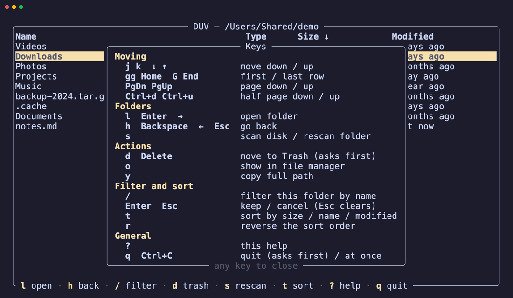
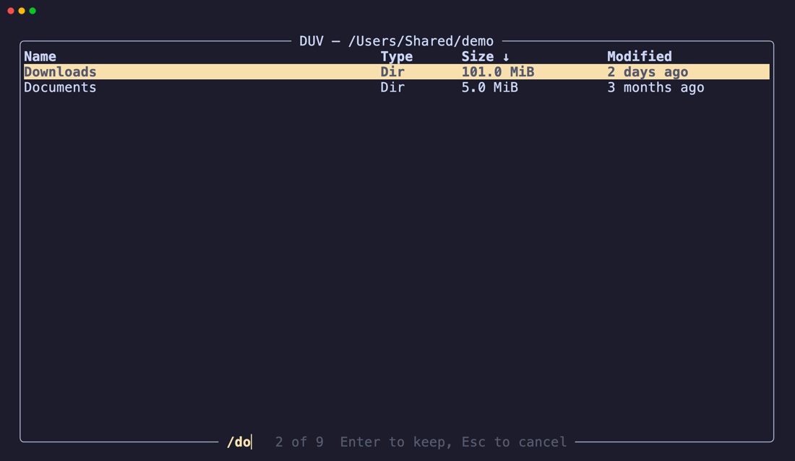
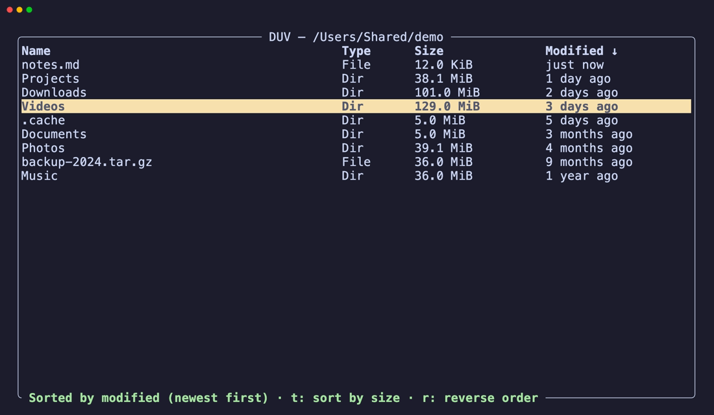
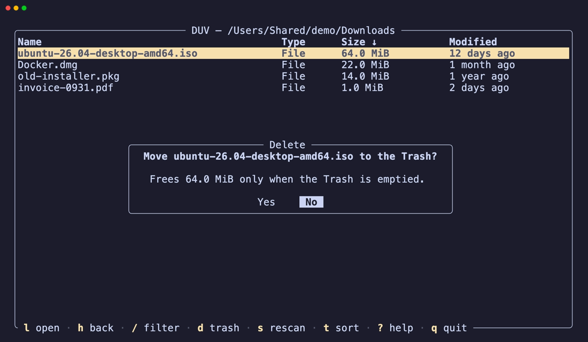

# duv (Disk Usage Visualizer)

[](https://github.com/nkien0204/duv/actions/workflows/ci.yml)

A fast terminal-based disk usage manager, written in Rust.

`duv` scans a disk or folder, shows an interactive breakdown of what's
consuming space, and lets you drill down and clean up without leaving the
terminal.


## Features

- 🚀 **Fast, parallel scanning**: sizes fill in live while the scan runs
- 🌳 **Instant drill-down**: browse the scanned tree without rescanning
- 🔃 **Sort** by size, name or last modified, in either direction
- 🔍 **Filter** the current folder by name as you type
- 🗑️ **Move to Trash** with confirmation, with totals updated right away
- 📂 **Show in file manager** and **copy path**, also over SSH
- 🧠 **Bounded memory** on huge disks, with a configurable budget
- 💻 **Cross-platform**: Linux, macOS and Windows

Sizes are measured like `du -x`: on-disk (allocated) size, hard-linked
files counted once, symlinks not followed, and other filesystems mounted
inside the scanned folder left out.

## Installation

With Rust 1.95 or newer:

```sh
cargo install duv
```

Or download a prebuilt binary for macOS, Linux or Windows from the
[Releases](https://github.com/nkien0204/duv/releases) page and put it on
your `PATH`.

Or build from source:

```sh
git clone https://github.com/nkien0204/duv.git
cd duv
cargo build --release
```

## Usage

```sh
duv [path]
```

Without arguments, `duv` opens on the list of mounted disks; press `s` to
scan the highlighted one. With a path (e.g. `duv .` for the current
directory), it starts by scanning that directory; pressing `h`/`Esc` from
there goes back to the disk list. Also supports `--help` and `--version`.

### Keys

Press `?` in the app to see these at any time.



| Key                             | Action                     |
| ------------------------------- | -------------------------- |
| `j` / `k` / `↓` / `↑`           | Move selection             |
| `g` `g` / `Home`                | Jump to first row          |
| `G` / `End`                     | Jump to last row           |
| `PgDn` / `PgUp`                 | Move one page down / up    |
| `Ctrl+d` / `Ctrl+u`             | Move half a page down / up |
| `l` / `Enter` / `→`             | Open directory             |
| `h` / `Backspace` / `←` / `Esc` | Go back / Cancel           |
| `s`                             | Start/Rescan               |
| `d` / `Delete`                  | Move to Trash (asks first) |
| `/`                             | Filter current folder      |
| `t`                             | Sort by size/name/modified |
| `r`                             | Reverse the sort order     |
| `o`                             | Show in file manager       |
| `y`                             | Copy full path             |
| `?`                             | Show all keys              |
| `q`                             | Quit (with confirmation)   |
| `Ctrl+C`                        | Quit unconditionally       |

### Filtering

`/` filters the current folder by name as you type (case-insensitive, any
part of the name, so `.mp4` or `cache` both work). `Enter` keeps the
filter and returns to navigation, `Esc` cancels or clears it, and opening
or leaving the folder clears it too.



### Sorting

`t` switches the order between size (largest first), name (A to Z) and
last modified (newest first), and `r` reverses it (smallest first, Z to A,
oldest first); the column header's arrow shows the direction (`↑`
ascending, `↓` descending). The choice applies to every folder and new
scans. The Modified column shows how long ago each entry changed (for a
folder, when its own entries last changed).



### Deleting

Deleting moves the entry to the system Trash (Recycle Bin on Windows), so
it can be restored; the space is freed once the Trash is emptied. The
confirmation popup defaults to **No**.



The confirmation says how much space emptying the Trash would free (and,
on Linux, where the Trash folder is), and after the delete the status line
confirms where the entry went. On Linux the Trash is the standard freedesktop folder,
usually `~/.local/share/Trash` (items on other drives may go to a
`.Trash-<uid>` folder on that drive). On a server with no desktop, empty it
with, for example, `gio trash --empty` or by deleting the contents of
`~/.local/share/Trash/files` and `~/.local/share/Trash/info`.

### Show in file manager, copy path

`o` opens the file manager with the entry selected (Finder, Explorer; on
Linux, its folder via `xdg-open`). Where there's no desktop to show it on
(over SSH, or on a server without a graphical display), it says so and
suggests `y` instead. `y` copies the entry's full path using the system
clipboard tool (`pbcopy`, PowerShell, or `wl-copy`/`xclip`/`xsel` on
Linux). Over SSH, it asks your terminal to copy instead (OSC 52), so the
path lands on *your* machine's clipboard; most modern terminals support
this, macOS Terminal.app does not. Both also work on the disk list.

### Memory use

`duv` keeps what it scans in memory so browsing is instant, up to a
budget of 256 MiB by default (roughly 3 million files and folders). On
larger trees, folders beyond the budget are kept as totals only (sizes
stay exact) and are scanned again when you open them, dropping the
folders you visited least recently to make room. Change the budget with:

```sh
duv --memory-budget 512 [path]
```

The budget covers `duv`'s own record of the tree; the process as a whole
uses more (typically up to about 1.5× the budget, plus some fixed
overhead).

### Platform notes

On Windows, sizes are file lengths rather than allocated space (so sparse
files count in full), hard links aren't detected, and other drives
mounted inside a scanned folder aren't left out.

## Roadmap

- Search the whole scanned tree and jump to a result
- Filter by size or extension
- Live monitoring mode to watch disk usage change over time
- Configurable themes and keybindings

See [CHANGELOG.md](./CHANGELOG.md) for what's in each release.

## Development

This project uses standard Cargo workflows:

```sh
cargo build
cargo run
cargo test
cargo fmt
cargo clippy
```

The images in this README are recorded with [VHS](https://github.com/charmbracelet/vhs)
on a made-up folder; to update them after UI changes:

```sh
cargo build --release
vhs assets/demo.tape
```

See [ARCHITECTURE.md](./ARCHITECTURE.md) for how the code is organized, and
[AGENTS.md](./AGENTS.md) for conventions and guidance if you're
contributing with the help of an AI coding agent.

## License

Licensed under the [MIT License](./LICENSE).
